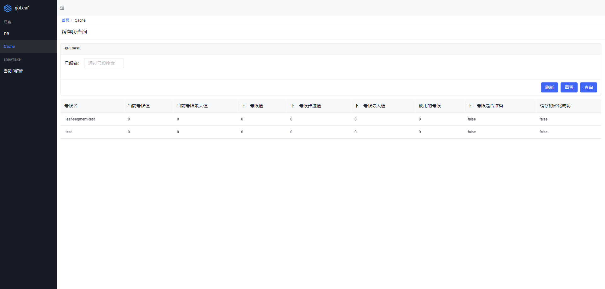

# Leaf

> There are no two identical leaves in the world.
>
> ```
> — Leibnitz
> ```
>

## 介绍

Go实现的号段模式以及雪花（Snowflake）发号器，基于Kratos框架，适用于此微服务框架以及服务发现服务

gRPC访问性能与Leaf同

> 接口兼容leaf，可直接替换
>
> 增加流水号每天自动清零的功能(增加字段`auto_clean`，仅保证单节点用，Nginx Backup)
>
> 增加接口，支持远程添加号段tag；
>
> 增加批量获取号段接口；
>
> 新增UI界面，支持新增，查看号段、缓存，解析雪花ID；

## 使用

### 号段模式

- 创建表

```mysql
CREATE DATABASE leaf;

CREATE TABLE `leaf_alloc` (
                              `biz_tag` varchar(128)  NOT NULL DEFAULT '', -- your biz unique name
                              `max_id` bigint(20) NOT NULL DEFAULT '1',
                              `step` int(11) NOT NULL,
                              `description` varchar(256)  DEFAULT NULL,
                              `update_time` timestamp NOT NULL DEFAULT CURRENT_TIMESTAMP ON UPDATE CURRENT_TIMESTAMP,
                              `created_time` timestamp NOT NULL DEFAULT CURRENT_TIMESTAMP,
                              `auto_clean` tinyint(1) default 0 null,
                              PRIMARY KEY (`biz_tag`)
) ENGINE=InnoDB;

insert into leaf_alloc(biz_tag, max_id, step, description) values('leaf-segment-test', 1, 2000, 'Test leaf Segment Mode Get Id');
```

- 配置

```yaml
data:
  database:
    segment_enable: true
    table_name: "leaf_alloc"
    driver: mysql
    source: root:123@tcp(127.0.0.1:3306)/leaf?charset=utf8&parseTime=True&loc=Local
    open_conn: 50
    idle: 10
    idle_timeout: 14400s
```

- 启动服务

```
make build
bin/goLeaf -conf configs/config.yaml
```

- 请求接口

```
curl http://localhost:8000/api/segment/get/leaf-segment-test

// 查看cache中号段的状态
http://localhost:8000/monitor/cache
// 查看DB中号段的数据
http://localhost:8000/monitor/db
```

### 雪花模式

- 配置

```yaml
data:
  etcd:
    snowflake_enable: true
    # 启动联动其他leaf节点校验时间的功能
    discovery_enable: false
    endpoints: ["127.0.0.1:2379"]
    dial_timeout: 2s
    # discovery_enable开启时使用，服务节点时间的偏差
    time_deviation: 50
```

- 请求接口

```
curl http://localhost:8000/api/snowflake/get

// 解析雪花ID
http://localhost:8000/decodeSnowflakeId
```

### UI界面

访问地址：http:port/web

> 例如：http://127.0.0.1:8001/web


---



---


